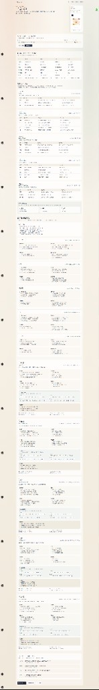

# Super-Individual-Factory

## 关于我

我是一名 AI 工程师，目前在某 500 强金融外企担任全栈工程师。  
长期关注一件事：把技术做成可落地、可变现的产品。

---

### 【超级个人】实验

2025 年 7 月起，我开启了【超级个人】实验——不只写代码，也亲自下场验证商业闭环。

目前覆盖方向：
- 自媒体
- 二手市场
- 虚拟货品
- 工程项目定制

目标是用工程能力，把内容、交易与交付串成一套可复制的增长路径。

---

### 开源与产品

我会持续开源自己研发的变现工具：

- **本地部署**：方便二次开发与私有化使用  
- **线上站点**：降低上手成本，直接体验、快速验证  

项目会围绕真实业务场景持续迭代，而不是停留在 Demo。

当前首发：`v1.0.0` **内容工作室（Content Growth）**——见下方文档。

---

### 项目示例：自媒体内容深度分析

粘贴作品链接，自动拆解选题、封面、文案结构、评论区与变现潜力，输出可复用的增长动作。

> 网站即将上线，敬请期待。

<p align="center">
  
</p>

---

### 合作与交流

欢迎内容合作、工具共建、定制开发，以及各类跨领域交流。  
如果你也在做个人品牌、副业增长或 AI 产品变现，欢迎一起讨论、互相拆解。

如果这些工具对你有帮助，手头也刚好宽裕，欢迎请我吃个饭，帮我回回血——我会继续把更多可复用的能力开源出来。

<p align="center">
  
</p>

---

## 内容工作室（v1.0.0）

以「项目」贯穿的本地内容工作流：

1. **三点一线出题** → 选题  
2. **爆款标题雷达** → 标题与大纲  
3. **平台文案**（含公众号）→ 多平台改写  
4. **口播洗稿** → 代理 Black Card `koubo`  
5. **成片渲染** → 选片型预设（知识口播/金句冲击/清单）→ AI/规则分镜表 → 点改语义 → 确认渲染（可选 TTS）  
6. **发布与效果** → 发布包、手填数据、交付 ZIP  

独立工具页（`/triple-line` 等）仍可快速试用，不落盘。

### 快速开始

```bash
npm install
npm run dev          # 仅工作室 UI :3000
npm run studio       # UI + 并列 black-card-video 引擎 :3456
```

浏览器打开 [http://localhost:3000](http://localhost:3000)。成片/洗稿需引擎已启动。

未配置 API Key 时，页面使用示例数据（二奢）或本地模板扩词，仍可完整体验 UI。

### 配置大模型（可选）

```bash
cp .env.example .env.local
```

| 变量 | 说明 |
|---|---|
| `LLM_API_KEY` / `DEEPSEEK_API_KEY` | API Key（也可用 `OPENAI_API_KEY`） |
| `LLM_BASE_URL` | OpenAI 兼容 Base URL；配了 DeepSeek Key 时默认 `https://api.deepseek.com/v1` |
| `LLM_MODEL` | 模型名；DeepSeek 默认 `deepseek-chat` |

#### DeepSeek 示例

```env
DEEPSEEK_API_KEY=sk-xxx
LLM_API_KEY=sk-xxx
LLM_BASE_URL=https://api.deepseek.com/v1
LLM_MODEL=deepseek-chat
```

#### xAI Grok 示例

```env
LLM_API_KEY=xai-xxx
LLM_BASE_URL=https://api.x.ai/v1
LLM_MODEL=grok-2-latest
```

页面上勾选「强制示例/模板模式」可跳过 API，便于对比。

### 页面

| 路径 | 功能 |
|---|---|
| `/` | 双引擎入口 |
| `/triple-line` | 三点一线出题 |
| `/title-radar` | 标题雷达分析 |
| `/platform-titles` | 本条分发顾问 + 发物料包 + 一键进项目；取向/指标/评论参考折叠查阅 |

### Cursor Skill

```
.cursor/skills/content-growth/SKILL.md
```

可直接说：

- `用三点一线分析：二奢`
- `获客出题：美甲，出 20 题`
- `分析这些爆款标题：`（随后粘贴多行标题）
- `标题雷达 + 同型标题`

### 目录结构

```
src/app/                 # 页面与 API
src/components/          # 圆环、题目卡、雷达图
src/lib/model/           # 类型、demo、降级、导出
src/lib/prompts/         # 与 Skill 同源 prompt
src/lib/llm/             # OpenAI 兼容客户端
.cursor/skills/content-growth/  # Cursor Skill
```
